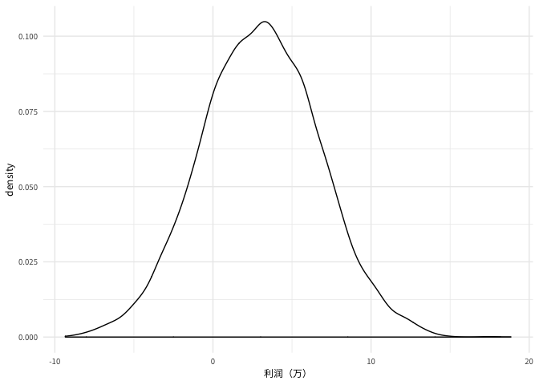
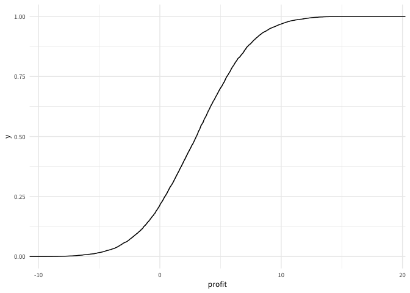

README
================

## 月利润分布

<!-- -->

## 95%置信度，利润的范围(万元)

    ##      2.5%     97.5% 
    ## -4.356561 10.338230

## 达成目标概率以及亏损风险

| 达成目标概率 |  亏损风险  |
| :----: | :----: |
| 0.0316 | 0.2135 |

## 利润的累计分布函数

<!-- -->

## 题目4

    tbl2 <- read_csv('Data/cpl_and_conversion.csv')
    
    profit_day_change <- function(){
        
        # 栗子数量
        nums_leads <- round(runif( 1, min = 3000, max = 4000), 0)
        
        
        data_frame(index = 1:nums_leads) %>% 
            mutate(cost_per_lead = round(runif( nums_leads , min = 8, max = 10),1),
                   profit_margin = runif( nums_leads, min = 350, max = 400)) %>% 
            inner_join(tbl2, by = 'cost_per_lead') %>% 
            summarise(cost_leads = sum(cost_per_lead), profit_margins = sum(profit_margin * conversion_rate))
